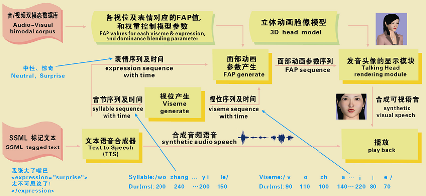
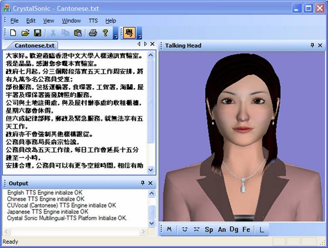
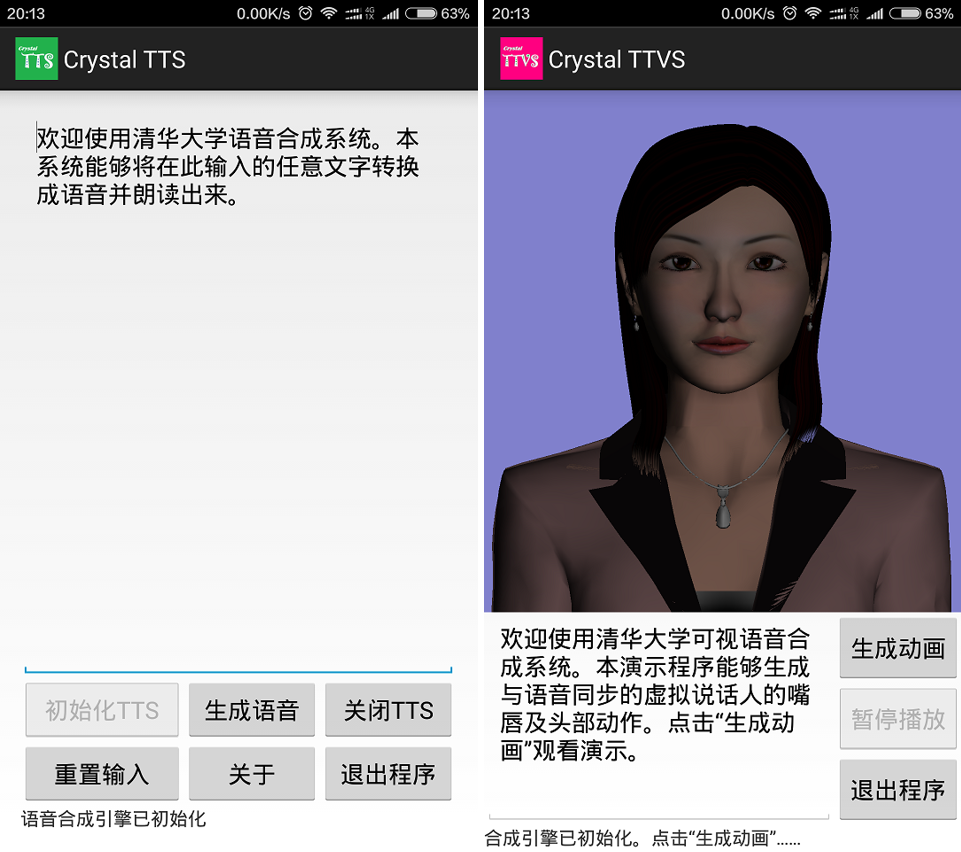
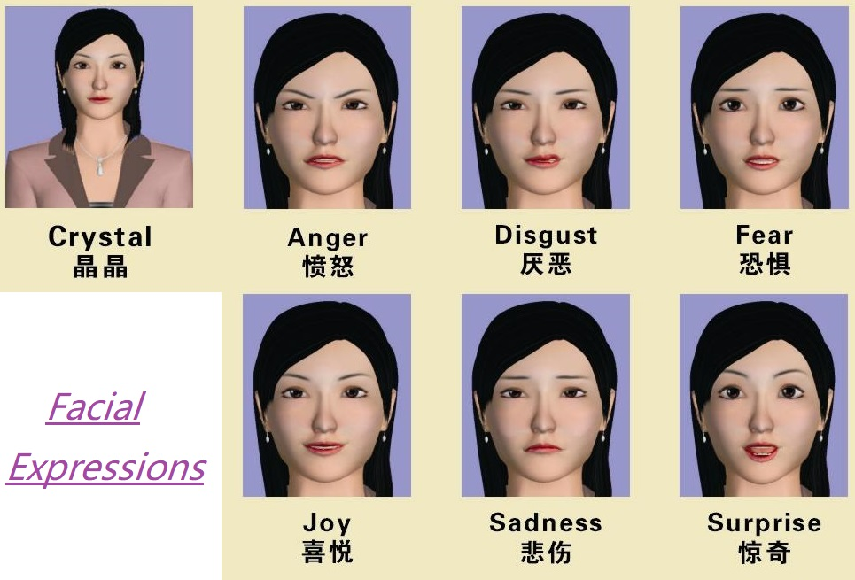
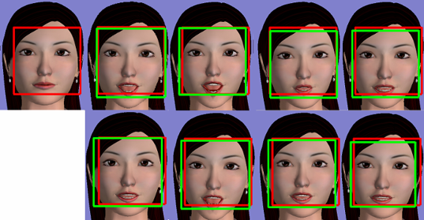

# Crystal Text-to-Visual-Speech (TTVS) Engine

Crystal TTVS engine is a real-time audio-visual Multilingual (Mandarin, Cantonese and English) speech synthesizer with a 3D expressive avatar.

The avatar model is parameterized according to the MPEG-4 facial animation standard, which offers a compact set of facial animation parameters (FAPs) and feature points (FPs) to enable realization of 20 visemes and 7 facial expressions.  A set of TTVS engines (including Mandarin, Cantoense and English) converts the input phoneme sequence with time information into visemes and then further into FAP sequence.  The 3D avatar animation is then rendered according to the FAP sequence by the Xface open source toolkit.

### Framework

* Real-time facial animation to generate synchronized lip movements on the avatar's face
* Natual facial expression and head movement with human-like avatar
* Platform independent framework for both stationary and embedded applications

  

### Reference

Please use the following papers for reference to this project:

* Zhiyong WU, Shen ZHANG, Lianhong CAI, Helen MENG, "[Real-time Synthesis of Chinese Visual Speech and Facial Expressions using MPEG-4 FAP Features in a Three-dimensional Avatar](http://www1.se.cuhk.edu.hk/~hccl/publications/pub/200609_Real-timeSynthesis.pdf)," [in] *International Conference on Spoken Language Processing (Interspeech2006, ICSLP)*, pp. 1802-1805. Pittsburgh, USA, 17-21 September 2006.

* Shen ZHANG, Zhiyong WU, Helen M. MENG, Lianhong CAI, "[Facial Expression Synthesis Using PAD Emotional Parameters for a Chinese Expressive Avatar](http://www1.se.cuhk.edu.hk/~hccl/publications/pub/ACII2007.pdf)," [in] *International Conference on Affective Computing and Intelligent Interaction (ACII2007)*, pp. 24-35. Lisbon, Portugal, 12-14 September 2007.

* Shen ZHANG, Zhiyong WU, Helen M. MENG, Lianhong CAI, "[Head Movement Synthesis based on Semantic and Prosodic Features for a Chinese Expressive Avatar](http://www1.se.cuhk.edu.hk/~hccl/publications/pub/ICASSP2007_ZHANG.pdf)," [in] *International Conference on Acoustics, Speech and Signal Processing (ICASSP2007)*, pp. 837-840. Hawaii, USA, April 15-20 2007.

### Support of Multilingual

The engine supports TTVS in (but not limited to) the following languages: Chinese Mandarin, Cantonese, and English.  You can actually implement your TTVS engine by overriding the **CSTHead::FapTTVS** (*/TTVS/FapTTVS.h/.cpp*), just like **CSTHead::FapMandarin**, **CSTHead::FapCantonese**, or **CSTHead::FapEnglish**.

### Support of Cross-platform

It is also possible to run the TTVS engine on different platforms, as the following figures illustrate.

  

  

### Support of Expressive Head Animation and Facial Expression

Six basic expressions of the 3D avatar:

  

Head movement on the 3D avatar:

  

### Compiling the Projects

#### Compiling

1. Compile TinyXML
   - Open "TinyXML" solution in "TinyXML" directory
   - Set "tinyxmlSTL" project as "StartUp Project"
   - Set "Solution Platforms" to "Win32"
   - Compile "tinyxmlSTL" project in "Release" version with "Multi-threaded DLL (/MD)" option
   - Compile "tinyxmlSTL" project in "Debug" version (Optional) with "Multi-threaded debug DLL (/MDd)" option

2. Complie Xface
   - Open "XFace.sln" solution in "XFace" directory
   - Set "XFace" project as "StartUp Project"
   - Set "Solution Platforms" to "Win32"
   - Compile "Xface" project in "Release" version
   - Compile "Xface" project in "Debug" version

3. Compile TTVS
   - Open "TTVSTest.sln" solution in "TTVSTest" directory
   - Set "TTVSTest" project as "Startup Project"
   - Set "Solution Platforms" to "Win32"
   - Compile "TTVS" and "TTVSTest" project in "Release" version
   - Compile "TTVS" and "TTVSTest" project in "Debug" version

#### Runing the demo

   - Go to "binary/win32" directory
   - Go to "release" or "debug" directory
   - Run TTVSTest.exe
   - Select menu "File/Open" to open the "fdp" file in "data/talkinghead/Song/song.fdp"
   - Select menu "TTVS/Mandarin", "TTVS/Cantonese", "TTVS/English" to switch between different langauges.
   - Select menu "TTVS/Screen Animation" for demo animation.
   
### References

* Motion Pictures Expert Group, ISO/IEC 14496-2:1999/Amd. 1: 2000(E). International Standard, Information Technology ¨C Coding of Audio-Visual Objects. Part 2: Visual; Amendment 1: Visual Extensions. 
* Balci, K., ¡°Xface: MPEG-4 based Open Source Toolkit for 3D Facial Animation¡±, [in] *Advance Visual Interfaces*, 399-402, 2004.
* [Xface 1.0 open source tools](http://xface.fbk.eu/)
